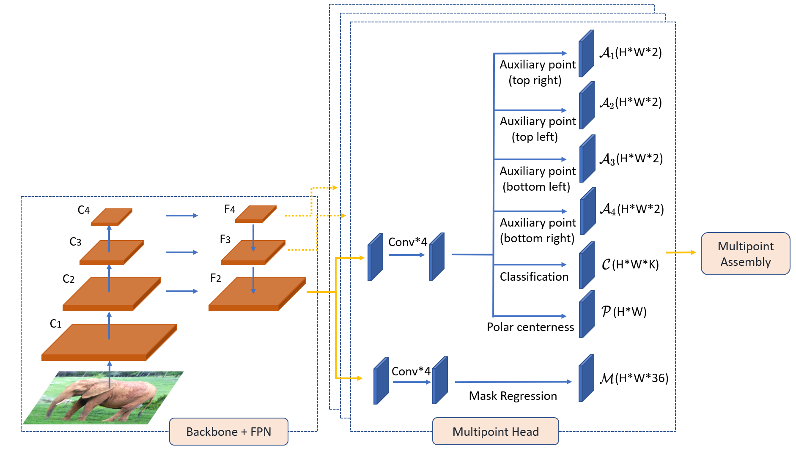
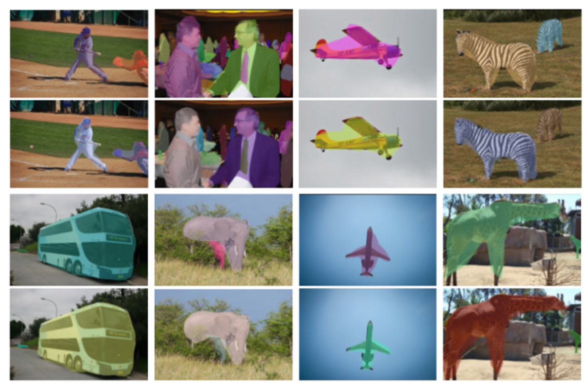
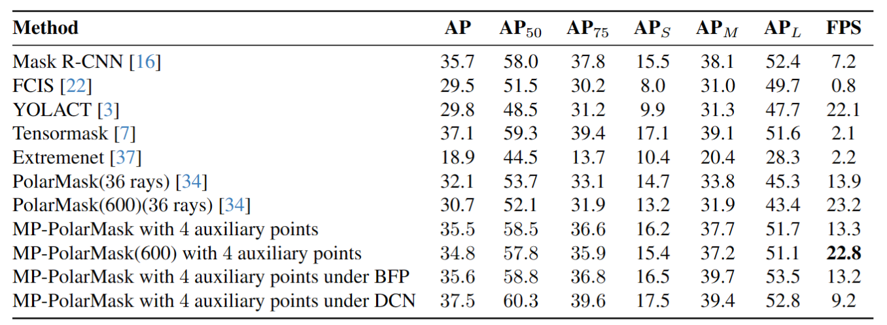

# Multi-Points PolarMask: One-Stage Instance Segmentation with Polar Respresentations

## Architecture and Training 
**Architecture:**



The MP-Head module also has multiple parallel networks, each for processing one feature map $F_i, i=2,3, \ldots, p$. Each network has the following branches: (i) one classification branch, 

(ii) one Polar centerness branch, (iii) one mask regression branch, and (iv) four auxiliary-center branches. 

Similar to PolarMask \cite{9157078}, the first three branches compute the matrices $\mathcal{C} \in R^W \times R^H \times R^k$, $\mathcal{P} \in R^W \times R^H$, 

and $\mathcal{M} \in R^W \times R^H \times R^n$, respectively.

Each auxiliary-point branch computes a matrix $\mathcal{A}_m \in R^W \times R^H \times R^2$, $m \in \{1, 2, \ldots, 4 \}$, where each tensor $(i, j, *) \in \mathcal{A}_m$ is a 2D displacement 

vector to locate the auxiliary center corresponding to the center $(i, j, *) \in \mathcal{C}$ in quad-rang $Q_m$. 


**Train:**
- ```python tools/train.py configs/polarmask/4gpu/polar_768_1x_r50.py --work_dir rescale_new_ap```

## Performances





## Citations
@article{xie2019polarmask,
  title={PolarMask: Single Shot Instance Segmentation with Polar Representation},
  author={Xie, Enze and Sun, Peize and Song, Xiaoge and Wang, Wenhai and Liu, Xuebo and Liang, Ding and Shen, Chunhua and Luo, Ping},
  journal={arXiv preprint arXiv:1909.13226},
  year={2019}
}