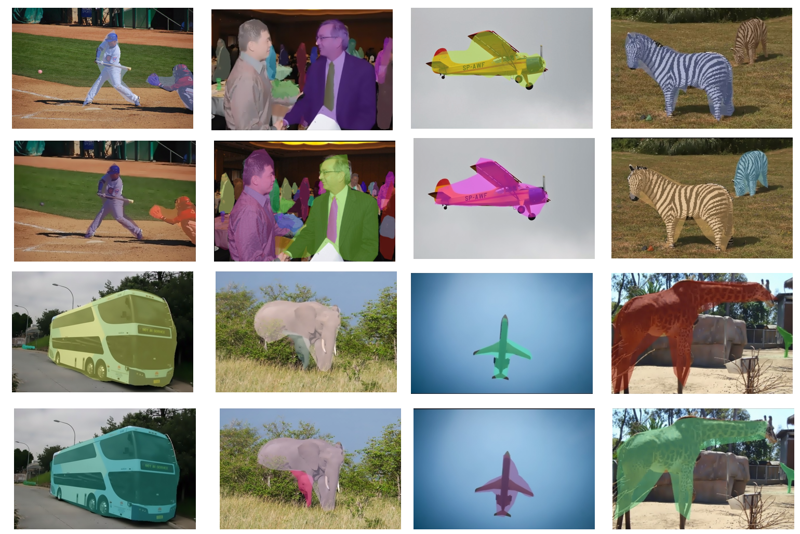

# Multi-Points PolarMask: One-Stage Instance Segmentation with Polar Respresentations


## Performances



## Architecture and Training 
**Train:**

**Train:**
- ```python tools/train.py configs/polarmask/4gpu/polar_768_1x_r50.py --work_dir rescale_new_ap```


**Test:**
##### 4gpu test
- ```sh tools/dist_test.sh configs/polarmask/4gpu/polar_768_1x_r50.py ./work_dirs/polar_768_1x_r50_4gpu/latest.pth 4 --out work_dirs/trash/res.pkl --eval segm```


## Contributing to the project
Any pull requests or issues are welcome.

## Citations
@article{xie2019polarmask,
  title={PolarMask: Single Shot Instance Segmentation with Polar Representation},
  author={Xie, Enze and Sun, Peize and Song, Xiaoge and Wang, Wenhai and Liu, Xuebo and Liang, Ding and Shen, Chunhua and Luo, Ping},
  journal={arXiv preprint arXiv:1909.13226},
  year={2019}
}